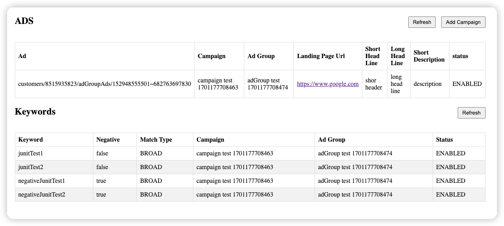
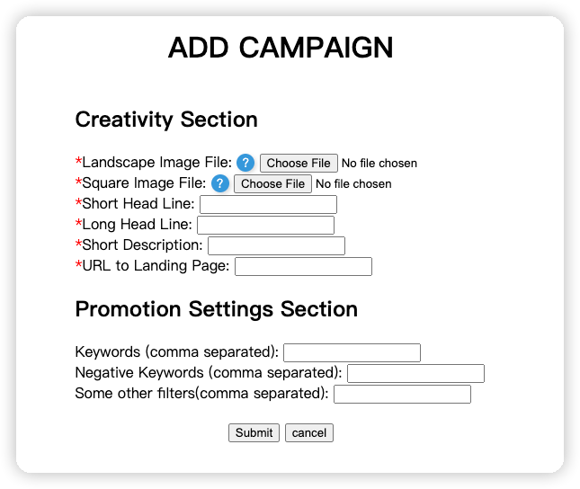
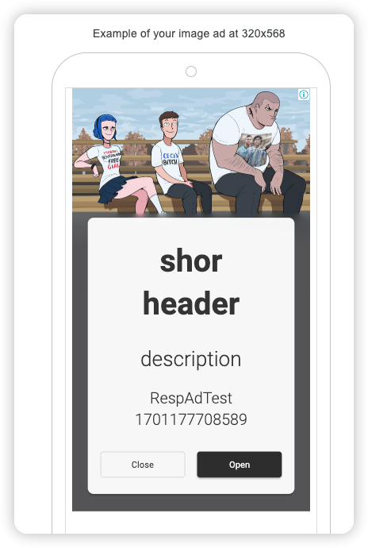

# 项目描述

该项目为google ads api的测试项目；项目中新增的广告类型为 Responsive display Ad;

整个项目运行过程中所使用的各个密钥key，并非微信群中的key，而是我自己注册的测试账号；（对于跑通整个流程测试账号足够用， 群中的key因缺少几个和保密性的原因，本项目并未采用）

此项目仅为测试项目，有些功能缺少必要性的校验；

## 功能

1. 所有广告/关键字 列表

2. 新增 Campaign
```
 注意： google 对 Responsive display Ad 上传的图片有格式和伸缩比例有要求。因此
 对于 lanscape image可使用项目目录下的assets/landscape.png文件；
 对于 square image可使用项目目录下的assets/square.jpg文件； 
```


## Google Ads 预览效果
```
因为goods ads api 不支持通过api获取预览URL，所以本项目的功能列表中也没能增加预览功能；
下图为google ads平台上的预览效果
```
